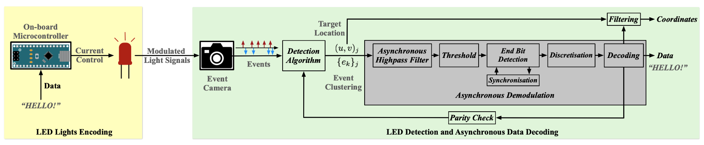
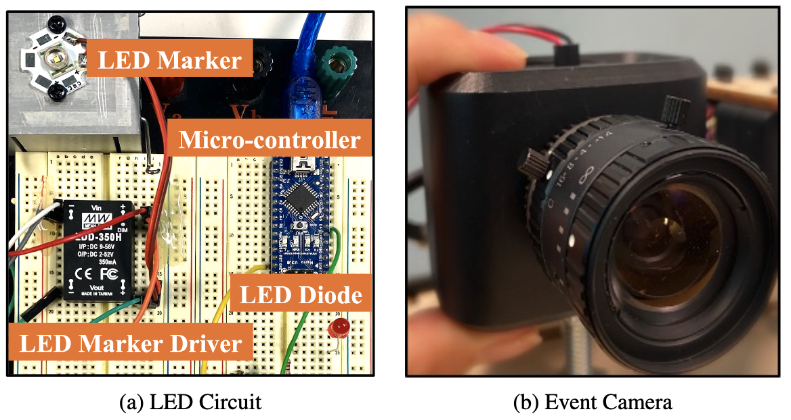

# Smart Visual Beacons with Asynchronous Optical Communications using Event Cameras

  

  

## For academic use only
Event cameras are bio-inspired dynamic vision sensors that respond to changes in image intensity with a high temporal resolution, high dynamic range and low latency. These sensor characteristics are ideally suited to enable visual target tracking in concert with a broadcast visual communication channel for smart visual beacons with applications in distributed robotics. Visual beacons can be constructed by high-frequency modulation of Light Emitting Diodes (LEDs) such as vehicle headlights, Internet of Things (IoT) LEDs, smart building lights, etc., that are already present in many real-world scenarios. The high temporal resolution characteristic of the event cameras allows them to capture visual signals at far higher data rates compared to classical frame-based cameras. In this paper, we propose a novel smart visual beacon architecture with both LED modulation and event camera demodulation algorithms. We quantitatively evaluate the relationship between LED transmission rate, communication distance and the message transmission accuracy for the smart visual beacon communication system that we prototyped. The proposed method achieves up to 4 kbps in an indoor environment and lossless transmission over a distance of 100 meters, at a transmission rate of 500 bps, in full sunlight, demonstrating the potential of the technology in an outdoor environment.

Ziwei Wang, Yonhon Ng, Jack Henderson and Robert Mahony

The paper was accepted by the IEEE International Conference on Intelligent Robots and Systems (IROS 2022) in Kyoto, Japan.

[[Conference paper]](https://ieeexplore.ieee.org/stamp/stamp.jsp?arnumber=9982016)[[arXiv preprint]](https://arxiv.org/abs/2208.01710)

## Citation
If you use or discuss our algorithm or datasets, please cite our paper as follows:
<pre>
@InProceedings{wang22iros,
  author        = {Ziwei Wang and Yonhon Ng and Jack Henderson and Robert Mahony},
  title         = {Smart Visual Beacons with Asynchronous Optical Communications using Event Cameras},
  booktitle     = {"International Conference on Intelligent Robots and Systems (IROS 2022)" },
  year          = {2022}
}
</pre>

## Code and Data - How to Use
Run [`decoder.m`](https://github.com/ziweiWWANG/Event-Beacon-Communication/blob/master/decoder.m), it will load event data from [./data](https://github.com/ziweiWWANG/Event-Beacon-Communication/tree/master/data/bright-led-outdoor). 
The decoding code [`decoder.m`](https://github.com/ziweiWWANG/Event-Beacon-Communication/blob/master/decoder.m) outputs decoded message and accuracy rate (message accuracy rate and bit accuracy rate).

## Notes
Should you have any questions or suggestions, please don't hesitate to get in touch with ziwei.wang1@anu.edu.au

